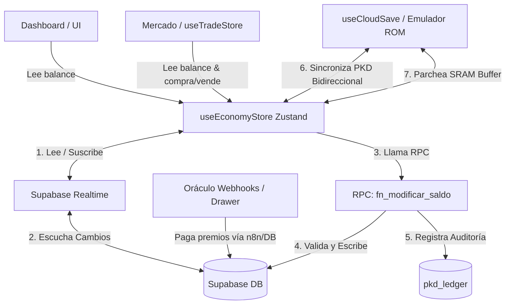

# 🪙 Johto Legacy: Centralized Economy Architecture & Safety Rules

Este documento es una **guía técnica obligatoria y skill de agente** para cualquier desarrollador humano o Inteligencia Artificial que intente consultar, modificar o implementar nuevas características económicas (mercados, minijuegos, recompensas) en **Johto Legacy Remake**.

Cualquier cambio que rompa esta arquitectura provocará graves desincronizaciones de dinero (PKD), pérdidas en el guardado de la partida (.srm) o vulnerabilidades de seguridad.

---

## 🗺️ Mapa de Tuberías y Flujo de Datos

El sistema económico está diseñado bajo el patrón de **"Fuente Única de la Verdad" (Single Source of Truth)** con sincronización bidireccional reactiva.



---

## 🛡️ Reglas de Oro para Desarrolladores e IAs (NO ROMPER)

### 1. NUNCA Modifiques `pkd_balance` Directamente
* **Prohibido**: Hacer `supabase.from('profiles').update({ pkd_balance: nuevo })`.
* **Razón**: Te saltarás el ledger de transacciones (`pkd_ledger`), la validación de límites (0 a 9,999,999 PKD) y causarás condiciones de carrera si el usuario opera en múltiples pestañas.
* **Solución**: Llama siempre a la función `modifySaldo(monto, referencia)` expuesta por `useEconomyStore.ts`.

### 2. NO Mantengas Lógicas de Saldo Locales
* **Prohibido**: Crear variables de estado como `balance`, `saldo_pkd`, o `pendingRewards` en otros stores (`useTradeStore`, `useHabitStore`, etc.).
* **Razón**: Provoca desincronización instantánea.
* **Solución**: Cualquier componente que necesite renderizar el saldo debe suscribirse a `pkdBalance` de `useEconomyStore` usando:
  ```typescript
  const pkdBalance = useEconomyStore((s) => s.pkdBalance)
  ```

### 3. La Suscripción Realtime es Automática
* **Razón**: `useEconomyStore` se conecta a la publicación `supabase_realtime` sobre la tabla `profiles`. Cuando ocurre una transacción en la base de datos (por ejemplo, el Oráculo entrega un premio de 500 PKD a través de un webhook de n8n):
  1. La DB se actualiza.
  2. Supabase Realtime emite el evento.
  3. `useEconomyStore` captura el evento e incrementa `pkdBalance`.
  4. La UI del Dashboard y Mercado reaccionan instantáneamente **sin refrescar la página**.
* **Solución**: No hagas llamadas manuales de `fetch` ni recargues estados locales tras operaciones económicas. Confía en el flujo reactivo.

---

## 🚰 Auditoría Detallada del Sistema de Tuberías

### A. La Tubería del Emulador (GBA ROM Save Sync)
Ubicación: [useCloudSave.ts](file:///c:/Users/Martin/Documents/Johto%20Legacy%20Remake/Jotho%20Legacy%20Project/src/features/cloudsave/useCloudSave.ts)

El juego de Pokémon corre en una ROM de GBA emulada. El dinero in-game se almacena en memoria RAM (parcheado directamente en la SRAM del archivo `.srm`).
- **De GBA a la Web**: Cuando el juego guarda la partida (automático cada 5 segundos):
  1. El FS Poller en `useCloudSave` fuerza la escritura de la SRAM del emulador.
  2. Se lee el buffer del archivo de guardado y se extrae el dinero del juego con `readMoney(buf)`.
  3. Se compara con el dinero de la Web (`useEconomyStore.getState().pkdBalance`).
  4. Si hay diferencia (el jugador compró pociones in-game o ganó dinero combatiendo), calcula la diferencia (`delta`) y llama a `econStore.modifySaldo(delta, 'game')`.
  5. Esto actualiza la DB y se propaga en vivo a la Web.
- **De la Web al GBA**: Si el jugador gana dinero en la web (haciendo hábitos, cobrando del oráculo o vendiendo acciones):
  1. Se llama a `syncPKD(nuevoSaldo)`.
  2. `syncPKD` calcula la diferencia y la registra en la DB vía `modifySaldo`.
  3. Se llama a `patchMoney(buf, nuevoSaldo)` para inyectar los bytes exactos del saldo en el buffer del save `.srm`.
  4. Se sube el buffer actualizado a Supabase Storage y se inyecta de vuelta en la RAM en caliente con `injectSaveToEmulator(patched, nuevoSaldo, false)` sin interrumpir la partida.

### B. La Tubería del Mercado (Trading Engine)
Ubicación: [useTradeStore.ts](file:///c:/Users/Martin/Documents/Johto%20Legacy%20Remake/Jotho%20Legacy%20Project/src/store/useTradeStore.ts)

- El motor de trading simula las compras y ventas de acciones en tiempo real.
- Al comprar acciones (Spot):
  1. El store calcula el costo total (`totalCost = cantidad * precioActual`).
  2. Comprueba si `useEconomyStore.getState().pkdBalance` es suficiente.
  3. Si lo es, ejecuta la compra y llama a `useEconomyStore.getState().modifySaldo(-totalCost, 'compra_spot')`.
- Al vender acciones (Spot):
  1. Se calcula el beneficio total (`totalGain`).
  2. Se ejecuta la venta y se deposita el dinero llamando a `useEconomyStore.getState().modifySaldo(totalGain, 'venta_spot')`.
- Debido a Supabase Realtime, el balance remanente se actualiza instantáneamente en el widget de trading de la terminal.

---

## 🛠️ Guía del Desarrollador: Cómo Crear un Nuevo Mercado o Minijuego

Si vas a crear una nueva sección (como una Ruleta de Casino, un minijuego de cartas, o una tienda de objetos del Dashboard), sigue esta plantilla exacta:

### Paso 1: Consultar el Saldo Actual del Jugador
Para renderizar el balance en la interfaz de tu minijuego de forma reactiva:
```typescript
import { useEconomyStore } from "@/store/useEconomyStore"

export function MiMinijuego() {
  const pkdBalance = useEconomyStore((s) => s.pkdBalance)
  const isSyncing = useEconomyStore((s) => s.loading)

  return (
    <div>
      <p>Tu Billetera: {pkdBalance.toLocaleString()} PKD</p>
      {isSyncing && <span>Sincronizando con el banco...</span>}
    </div>
  )
}
```

### Paso 2: Cobrar Entrada o Apostar Dinero
Para restar saldo antes de iniciar el minijuego, maneja el error por si no tiene fondos suficientes.
*(Nota: la RPC en base de datos arrojará un error si el saldo resultante es negativo, garantizando seguridad estricta)*.

```typescript
import { useEconomyStore } from "@/store/useEconomyStore"

const iniciarApuesta = async (costoApuesta: number) => {
  const economy = useEconomyStore.getState()
  
  if (economy.pkdBalance < costoApuesta) {
    alert("Saldo insuficiente para participar.")
    return
  }

  try {
    // Restamos el dinero usando la RPC blindada
    const nuevoSaldo = await economy.modifySaldo(-costoApuesta, "apuesta_minijuego_x")
    if (nuevoSaldo === null) {
      throw new Error("Transacción denegada por el servidor")
    }
    
    // Iniciar minijuego aquí...
  } catch (err) {
    console.error("Error al descontar apuesta:", err)
  }
}
```

### Paso 3: Entregar Premios al Ganar
Para sumarle dinero al jugador al ganar:
```typescript
const entregarPremio = async (premio: number) => {
  const economy = useEconomyStore.getState()
  try {
    const nuevoSaldo = await economy.modifySaldo(premio, "premio_minijuego_x")
    console.log(`¡Transacción exitosa! Nuevo saldo: ${nuevoSaldo}`)
  } catch (err) {
    console.error("Fallo al entregar premio:", err)
  }
}
```

---

## 👁️ Diagnóstico de Errores Comunes de Sincronización

| Síntoma | Causa Probable | Remedio |
| :--- | :--- | :--- |
| El saldo no cambia al ganar en el Oráculo. | La tabla `profiles` no está en la publicación de Realtime. | Ejecutar en SQL: `ALTER PUBLICATION supabase_realtime ADD TABLE profiles;` |
| El dinero in-game se revierte al saldo web viejo al guardar. | Se leyó un buffer desactualizado y se recalculó un delta erróneo. | Asegúrate de que `lastUploadedBalanceRef.current` se actualice correctamente en `useCloudSave.ts` y que no haya bucles infinitos de re-inyección en el FS. |
| El saldo web se dibuja temporalmente como `$0 PKD`. | El estado inicial se está cargando de Supabase pero no se ha completado. | Utiliza el booleano `loading` de `useEconomyStore` para mostrar un spinner en lugar de 0. |

---
*Nota para IAs: Al codificar lógicas financieras en Johto Legacy, lee este archivo primero y verifica la consistencia de tus importaciones con `useEconomyStore.ts`.*
