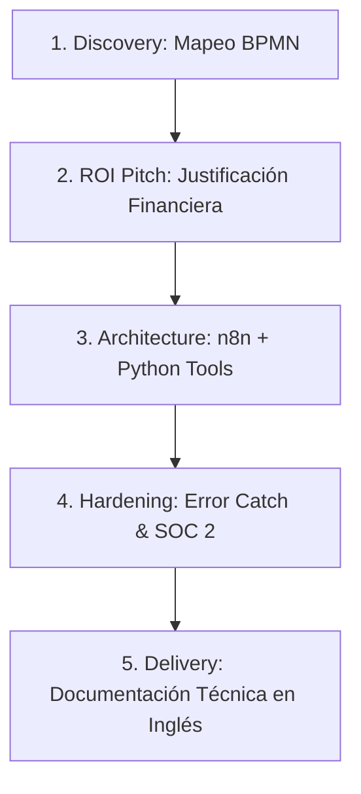
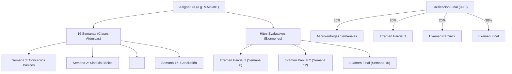
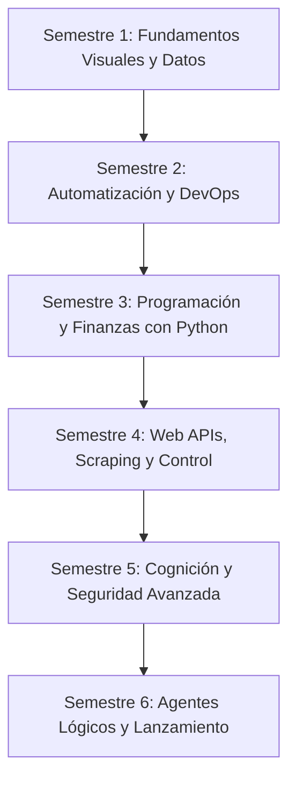
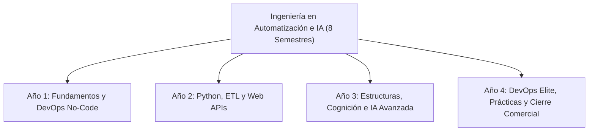
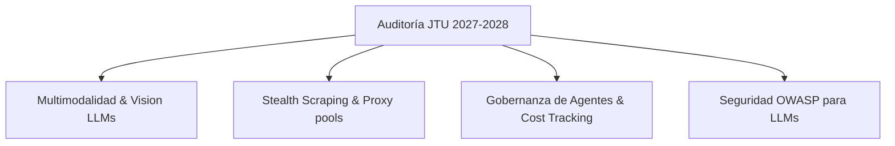

# 🏛️ Universidad de Johto (Johto Tech University - JTU)
## Manifiesto de Ideación y Arquitectura del Futuro (2027-2028)

Este documento es nuestra **pizarra de diseño (War Room)**. Aquí compilamos, debatimos y estructuramos las ideas para la creación de un submódulo educativo exigente y enfada en las habilidades que te conseguirán clientes internacionales y trabajo remoto premium de cara a **2027-2028**.

---

## 🧭 1. El Mapa Tecnológico (2026-2028): n8n vs. Python vs. Claude Code

Una duda crucial para tu carrera: *Si en 2026 herramientas como Claude Code, Lovable o Cursor pueden programar y automatizar solas, y muchos usan solo Python puro... ¿Por qué aprender n8n? ¿Cómo destacar frente a empresas grandes y clientes?*

### 💡 La Realidad de la Automatización Industrial (Enterprise Level)
El 90% de los programadores principiantes creen que "saber automatizar" es escribir un script de Python de 100 líneas y correrlo en su computadora local. En una **empresa real de alto nivel (que paga tarifas de $10,000 a $30,000 USD)**, los scripts huérfanos de Python son un peligro. Las empresas exigen n8n + Python por dos razones fundamentales:

1.  **Observabilidad e Historial de Ejecuciones (Audit Trails)**:
    Si una automatización crítica falla un martes a las 3:00 AM procesando una factura de $50,000 USD, un director de operaciones no puede meterse a una terminal a leer logs en texto plano de un script de Python. Necesita abrir **n8n**, ver visualmente qué nodo falló, examinar el JSON de entrada y hacer clic en **"Retry Node"** para solucionar la crisis en 20 segundos. **Eso es observabilidad industrial**.
2.  **Mantenibilidad y Escalabilidad**:
    Un script de Python puro escrito por un freelancer es una caja negra. Si ese freelancer se va, mantener el script es un dolor de cabeza. n8n actúa como la **"Autopista Visual de Datos" ( nervous system)** de la empresa. Cualquiera puede entender el flujo del negocio.
3.  **El Rol de Claude Code/Cursor**:
    No compites contra Claude Code; **Claude Code es tu empleado**. Tú eres el **Arquitecto de Sistemas**. Usarás Claude Code para escribir los scripts complejos de Python que meterás dentro de los nodos de código de n8n, acelerando tu desarrollo 10 veces frente a desarrolladores antiguos.

### 🏆 El Perfil Híbrido Ganador (El Consultor de Elite)
Las empresas no buscan a un programador de n8n que solo sabe conectar cajitas de arrastrar y soltar, ni a un purista de Python que tarda 3 semanas en conectar una API de Salesforce con OAuth, ni a alguien que no sabe dónde se guardan los datos.
El mercado de alto valor contrata al **Arquitecto de Automatización Híbrido y de Datos**:
*   Usa **n8n** como el sistema nervioso central (conexiones, autenticaciones, visualización, flujos).
*   Usa **Supabase / PostgreSQL** como el cerebro del sistema (donde reside el estado persistente, los perfiles de usuario, logs de transacciones, colas de tareas y bases de conocimiento vectorial).
*   Usa **Python** para procesar datos complejos, scraping avanzado y lógicas pesadas donde las cajitas visuales son insuficientes.
*   Usa **Claude/IAs** para generar los códigos en segundos.

---

## 🎓 2. Estructura Unificada: Máster en Automatización de Procesos de Negocio e Integración IA (MAPIA)

En lugar de carreras fragmentadas, proponemos una **única carrera de élite** dividida en 4 Pilares Modulares que simulan un plan universitario de 1 a 3 años (a tu propio ritmo, estimado en ~200 horas lectivas a 10h semanales). Este máster te prepara para casos de uso reales y **certificaciones oficiales de la industria**.

```
                           [ MÁSTER M.A.P.I.A ]
                                    │
         ┌──────────────────┬───────┴──────────┬──────────────────┐
         ▼                  ▼                  ▼                  ▼
   [ PILAR I ]        [ PILAR II ]       [ PILAR III ]      [ PILAR IV ]
   Consultoría &       Orquestación     Código Avanzado     IA Pragmática
   Modelado BPMN      n8n Enterprise     (Python Tools)     y Cumplimiento
```
## 🎓 2. Currícula Oficial: Ingeniería en Arquitectura de Automatizaciones y Agentes de IA
### Plan de Estudios Oficial (3 Años / 6 Semestres / 24 Asignaturas) — Vista de Águila

Este es el mapa curricular definitivo de la **Johto Tech University (JTU)**. Hemos estructurado la carrera en **4 asignaturas por semestre (24 en total)**, combinando un rigor técnico extremo con **nombres de alto impacto y atractivo comercial** diseñados para motivar al alumno y certificar su preparación absoluta para el mercado internacional remoto de cara a **2027-2028**.

```
                           [ MAPA CURRICULAR J.T.U. ]
                                       │
        ┌──────────────────────────────┼──────────────────────────────┐
        ▼                              ▼                              ▼
   [ AÑO I ]                       [ AÑO II ]                    [ AÑO III ]
Infraestructura Ágil,            Programación de APIs,         IA Generativa Avanzada,
Orquestación & Negocio         ETL & Ciberseguridad Cloud     LangGraph & Multi-Agentes
```

---

### 🏛️ AÑO I: Ingeniería de Procesos, Orquestación y Habilidades Globales
*Enfoque: Mapear la lógica operativa de las empresas, diseñar arquitecturas de datos relacionales, automatizar flujos complejos y dominar la comunicación técnica inicial en inglés.*

#### 📋 Semestre I: Arquitectura de Procesos, Diseño de Datos y Vocabulario Técnico
*   **MAP-101: Consultoría Socrática e Ingeniería de Procesos de Negocio**
    *   *De qué trata*: Técnicas de descubrimiento de dolores operativos en empresas mediante entrevistas guiadas, traduciéndolos a diagramas de flujo bajo el estándar internacional **BPMN 2.0**.
*   **MAP-102: Arquitectura del Cerebro de Datos e Integridad Referencial**
    *   *De qué trata*: Diseño de esquemas de bases de datos relacionales impecables (tablas, relaciones de uno a muchos, llaves primarias/foráneas) en Supabase y PostgreSQL.
*   **MAP-103: Ingeniería Financiera y Modelos de Retorno de Inversión (ROI)**
    *   *De qué trata*: Fórmulas matemáticas para calcular las horas-hombre y costos que tu automatización ahorrará al cliente, justificando propuestas comerciales de alto ticket ($3,000+ USD).
*   **ENG-101: Inglés Técnico I: Vocabulario de Sistemas y Operaciones**
    *   *De qué trata*: Dominar la jerga técnica internacional de desarrollo de software, APIs, bases de datos y flujos de datos. Explicar arquitecturas simples sin vacilaciones.

#### ⚙️ Semestre II: Orquestación Industrial, DevOps y Documentación Técnica
*   **MAP-201: Orquestación de Ecosistemas Digitales con n8n Enterprise**
    *   *De qué trata*: Uso profesional avanzado de n8n: nodos de código con JavaScript, sub-workflows modulares, manejo avanzado de errores y conexiones complejas con Salesforce, Stripe y HubSpot.
*   **MAP-202: Arquitectura de Eventos Reactivos y Webhooks de Base de Datos**
    *   *De qué trata*: Diseñar flujos asíncronos en tiempo real que se disparan de forma automática ante cambios de estado físicos en bases de datos PostgreSQL de Supabase.
*   **MAP-203: DevOps Práctico y Virtualización de Servidores con Docker**
    *   *De qué trata*: Adquirir e inicializar un servidor Linux virtual (VPS) económico, desplegar n8n de forma ilimitada usando Docker y configurar subdominios con certificados de seguridad SSL.
*   **ENG-201: Inglés Técnico II: Redacción de Propuestas y Documentación Técnica**
    *   *De qué trata*: Redactar minutas técnicas, documentar diagramas de procesos en Markdown y escribir correos de negocios de alto nivel para clientes corporativos de habla inglesa.

---

### 🐍 AÑO II: Programación de Herramientas, Data Engineering y Seguridad Cloud
*Enfoque: Convertirte en un programador backend de nivel mundial. Escribir código defensivo en Python, crear tus propios microservicios robustos, consolidar datos empresariales con Pandas y blindar la seguridad de tus APIs.*

#### 🛡️ Semestre III: Desarrollo de Backend, Microservicios y Pitching de Negocios
*   **MAP-301: Programación Defensiva y Algoritmia Avanzada en Python 3.12+**
    *   *De qué trata*: Escribir scripts limpios y tolerantes a fallos desde cero, procesar estructuras JSON multinivel y manejar de forma impecable las excepciones en Python.
*   **MAP-302: Construcción de Microservicios con FastAPI y Validación Pydantic**
    *   *De qué trata*: Diseñar tus propios endpoints de API ligeros y rápidos para construir herramientas personalizadas (Tools) seguras y consumibles por agentes inteligentes.
*   **MAP-303: Extracción Dinámica de Datos y Web Scraping con Playwright**
    *   *De qué trata*: Programar robots para navegar de forma automatizada por la web, extraer datos estructurados dinámicamente y guardarlos en Supabase de forma segura.
*   **ENG-301: Pitching de Proyectos y Negociación Remota en Inglés**
    *   *De qué trata*: Práctica oral interactiva (roleplay) para sostener videollamadas de ventas y presentar tus diseños técnicos frente a directores de tecnología extranjeros con confianza.

#### 🪙 Semestre IV: Data Engineering Ligero, Ciberseguridad y Gestión Ágil
*   **MAP-401: Pipelines de ETL y Manipulación Científica de Datos con Pandas**
    *   *De qué trata*: Extracción, transformación, deduplicación y carga rápida de miles de filas de datos financieros y de marketing usando la librería Pandas de Python antes de guardarlos en PostgreSQL.
*   **MAP-402: Ciberseguridad de Webhooks y Criptografía HMAC**
    *   *De qué trata*: Asegurar la integridad de tus flujos: validación de firmas digitales HMAC en endpoints de n8n, cifrado de credenciales y prevención de ataques de inyección.
*   **MAP-403: Protocolos de Autenticación Complejos y OAuth 2.0 Corporativo**
    *   *De qué trata*: Implementación de ciclos de refresco de tokens de seguridad para que tus integraciones empresariales no pierdan conexión con los servicios de por vida.
*   **MAP-404: Gestión Ágil de Proyectos: Metodologías Scrum y DevTools (Git/GitHub)**
    *   *De qué trata*: Trabajar como un profesional en equipos remotos: control de versiones con Git, ramas colaborativas en GitHub, y flujos de trabajo organizados en tableros Scrum (Jira/Notion).

---

### 🤖 AÑO III: Inteligencia Artificial Aplicada, LangGraph y Lanzamiento al Mercado
*Enfoque: La cúspide de la ingeniería de software moderna. Dominar bases vectoriales, cumplir con normativas de privacidad globales y programar redes de multi-agentes inteligentes deterministas.*

#### 🧠 Semestre V: IA Pragmática, Recuperación Semántica y Aseguramiento de Calidad
*   **MAP-501: Ingeniería de Prompts Científica y Control de Alucinaciones**
    *   *De qué trata*: Técnicas de inyección de contexto de pocos ejemplos (few-shot), encadenamiento de pensamientos y estructuración semántica para forzar respuestas lógicas en los LLMs.
*   **MAP-502: Búsqueda Semántica y Cerebros Vectoriales con pgvector**
    *   *De qué trata*: Almacenamiento de embeddings semánticos en PostgreSQL/Supabase y diseño de sistemas RAG (Retrieval-Augmented Generation) para el conocimiento corporativo del cliente.
*   **MAP-503: Privacidad de Datos, Cumplimiento Global (GDPR/SOC 2) y Auditoría de Tokens**
    *   *De qué trata*: Configurar políticas Row Level Security (RLS) en Supabase, auditar el consumo financiero de APIs de IA y garantizar el cumplimiento de normativas de datos médicos y financieros.
*   **MAP-504: Testing Automatizado, Pytest y QA de Sistemas Híbridos**
    *   *De qué trata*: Escribir pruebas automatizadas con Pytest para verificar que tus scripts de Python y flujos de datos toleren cargas de trabajo extremas sin romperse antes de ir a producción.

#### 🏆 Semestre VI: Grafos de Estado Deterministas y Lanzamiento de Carrera
*   **MAP-601: Arquitectura de Agentes Lógicos con LangGraph**
    *   *De qué trata*: Diseñar sistemas multi-agente donde la IA toma decisiones adaptativas pero estrictamente guiada a través de un grafo de estado determinista programado por ti.
*   **MAP-602: Function Calling y Orquestación de Herramientas Inteligentes**
    *   *De qué trata*: Conectar a tus agentes inteligentes con tus microservicios de Python y APIs externas, permitiendo al LLM ejecutar código estructurado de forma controlada.
*   **MAP-603: Proyecto de Fin de Carrera (Capstone): Consultoría y Despliegue Real**
    *   *De qué trata*: Consultoría a un cliente real: modelado BPMN, base de datos relacional en Supabase, automatizaciones en n8n auto-hospedado y un agente de IA funcional en producción real.
*   **MAP-604: Ingeniería de Marca Personal, Adquisición Global y Finanzas Freelance**
    *   *De qué trata*: Optimización de LinkedIn para reclutadores internacionales, creación de portafolio técnico en GitHub, redacción de contratos (NDAs/IPs), cobros globales (Deel, Wise, Stripe) e impuestos de trabajo remoto.

---

## 💼 3. El Método: Johto Automation Framework (JAF)
Para que seas ultra atractivo para empresas extranjeras y puedas vender proyectos freelance de miles de dólares, la academia te enseñará un método de entrega de 5 pasos que utilizaremos como marco de tus proyectos en la universidad:



1.  **Discovery (Mapeo BPMN)**: Auditar el flujo de trabajo actual de una empresa y modelarlo visualmente para encontrar los cuellos de botella de tiempo.
2.  **ROI Pitch (Justificación Financiera)**: Presentar una propuesta clara calculando el dinero y tiempo exacto que la empresa se ahorrará con tu automatización.
3.  **Architecture (Diseño n8n + Python)**: Utilizar n8n como el chasis del flujo de datos, inyectando scripts y herramientas robustas en Python para tareas complejas.
4.  **Hardening (Blindaje)**: Agregar control de errores detallado en cada rama del flujo n8n para asegurar que el sistema nunca falle en silencio ni rompa normativas de cumplimiento de datos.
5.  **Delivery (Documentación Técnica en Inglés)**: Redactar la documentación del workflow en inglés profesional impecable, haciéndola perfectamente legible para cualquier equipo internacional de ingeniería.

---

## 🛡️ 4. El Motor de Auditoría y Entrega de Proyectos (Code Review)

*   **Paso 1**: Recibes una materia de la universidad y diseñas la solución (escribes el código Python localmente, o creas el workflow en tu n8n real).
*   **Paso 2**: Copias el código o exportas el JSON de tu flujo y lo pegas en el **Auditor Universitario** de la web de Johto.
*   **Paso 3**: El Oráculo ejecuta un análisis semántico y estructural:
    *   *Verificación de Lógica*: ¿Estás usando n8n de manera eficiente o tienes nodos repetitivos?
    *   *Manejo de Excepciones*: ¿Qué pasa si la API responde un error 500? ¿Tu flujo se cae o captura el error correctamente?
    *   *Compliance & Security*: ¿Es auditable?
*   **Paso 4**: Recibes un **Feedback de Tech Lead real**: un desglose línea por línea o nodo por nodo sobre qué optimizar, y tu calificación del 1.0 al 10.0 registrada en tu Kardex.

---

## 🎨 5. Diseño UX/UI y Metodologías de Aprendizaje (Tendencias 2026)

Para que la Johto Tech University no parezca un Moodle aburrido del año 2010, el diseño de la interfaz y la experiencia de usuario (UX) debe alinearse con las **tendencias educativas de 2026**: una estética premium, sistemas adaptativos y cero fricción.

### 5.1 Estética Visual: "Zen-Tech" Luminoso (Light Mode First)
*   **Modo Claro Primordial (Light Mode First)**: Fondos blancos inmaculados y tarjetas en tonos hueso o gris ultra-suave. Una estética que transmite pureza, orden y claridad mental para el estudio (similar al diseño escandinavo). El Modo Oscuro será una opción secundaria (toggle) para quienes programan de noche.
*   **Acentos y Sombras Suaves (Soft UI)**: Uso de sombras difusas para dar elevación a las tarjetas de contenido. Los acentos interactivos (botones, barras de progreso) mantienen los colores cyan neón y violeta corporativo, pero adaptados a una paleta brillante para que destaquen elegantemente sobre el blanco.
*   **Glassmorfismo y Funcionalidad**: Uso de paneles translúcidos muy sutiles. Cero distracciones: el código y los diagramas BPMN resaltan limpiamente sobre el fondo claro.
*   **Tipografía Científica**: Uso de fuentes modernas, limpias y altamente legibles para código y documentación (ej. *Inter* para lectura, *JetBrains Mono* para código).

### 5.2 Metodología UX Educativa (2026)
*   **Mobile-First y Device-Agnostic**: La academia es 100% responsiva desde el inicio. Los alumnos pueden estudiar la teoría en su móvil mientras viajan, y sentarse frente a la PC únicamente para los laboratorios de despliegue en Docker y n8n.
*   **Microlearning y "Bite-Sized"**: Los bloques largos de video de 2 horas están muertos. En JTU, el conocimiento se entrega en píldoras hiper-focalizadas de 5 a 10 minutos (Micro-lecciones) acompañadas de un ejercicio práctico o un quiz rápido.
*   **Data-Driven Personalization**: El "Oráculo" (IA) monitorea en qué fallas. Si fallaste en estructurar un JSON en la materia de n8n, el sistema te recomendará sutilmente un repaso de Javascript de 3 minutos antes de dejarte avanzar.
*   **Dashboard Multipantalla**: La vista de estudio principal se divide en tres paneles fluidos:
    1.  **Sidebar de Progreso Gamificado**: Tu árbol de habilidades (Progreso BPMN -> LangGraph), nivel actual, e insignias ganadas.
    2.  **Área de Consumo (Centro)**: El contenido teórico interactivo (Markdown, fragmentos de código, videos cortos).
    3.  **Auditor de Código/JSON (Derecha)**: Un panel integrado donde pegas tu JSON o script de Python y recibes validación instantánea del motor de la universidad sin salir de la plataforma.

---

## 📝 6. Registro de Ajustes de la Ideación (Log de Cambios)
*   **17 de mayo de 2026**: Creación de la pizarra de ideas.
*   **17 de mayo de 2026**: Eliminación del ROM Sync para mantener la arquitectura de guardado web impecable y segura.
*   **17 de mayo de 2026**: **Rediseño Completo del Plan de Estudios**: Unificación en una única carrera premium: el **Máster MAPIA**, enfocado en formar Consultores y Arquitectos de Automatización Híbridos (n8n + Python + Claude) para el mercado internacional 2027-2028.
*   **17 de mayo de 2026**: Diseño del **Johto Automation Framework (JAF)** como la metodología estándar que el alumno aprenderá para adquirir y entregar proyectos de alto ticket a clientes reales.
*   **17 de mayo de 2026**: **Integración Profunda de Bases de Datos & Supabase**: Inclusión obligatoria de PostgreSQL relacional, Database Webhooks de Supabase, clientes de Python para base de datos y la extensión de embeddings `pgvector` en la currícula de todos los pilares como el "cerebro persistente" del sistema.
*   **17 de mayo de 2026**: **Inclusión de Data Engineering Ligero (ETL)**: Integración formal de la ingeniería de datos ligera en el Pilar III (transformación, limpieza de datos estructurados con Pandas y migración atómica masiva). Esto permite al egresado vender servicios de consolidación de bases de datos operativas y financieras a fundadores y empresas medianas.
*   **17 de mayo de 2026**: **Ampliación DevOps, Ciberseguridad y LangGraph**: Inyección formal de (1) Autohospedaje de n8n mediante Docker y servidores VPS, (2) Seguridad avanzada de APIs con firmas HMAC y OAuth 2.0 personalizados, y (3) Grafos de Agentes Lógicos usando LangGraph con llamadas de herramientas (Function Calling) deterministas de cara al 2027-2028.
*   **17 de mayo de 2026**: **Clarificación de Estrategia Cloud**: Adición del concepto de "Nube Práctica vs. Compleja" en el Pilar II, enfocándonos en VPS/Docker económicos y seguros, aprendiendo a consumir servicios clave (como AWS S3) mediante APIs y n8n sin el dolor de cabeza de configurar la infraestructura de AWS.
*   **17 de mayo de 2026**: **Evolución a Grado de Ingeniería de 3 Años (Vista de Águila)**: Transformación del plan modular simplificado en una currícula formal de **Ingeniería en Arquitectura de Automatizaciones y Agentes de IA** con 6 semestres académicos y asignaturas codificadas con nombres ultra-atractivos de marketing educativo internacional de cara a 2027-2028.
*   **17 de mayo de 2026**: **Saturación Absoluta y Expansión a 24 Asignaturas**: Ampliación curricular a 4 materias por semestre para inyectar 4 pistas de despegue profesional omitidas en la versión inicial: (1) Inglés Técnico y Negociación Oral Internacional para multiplicar ingresos x10, (2) Gestión de Proyectos Ágiles (Scrum, Git y GitHub) para trabajo remoto corporativo, (3) Testing Automatizado con Pytest y QA para blindar flujos antes de producción, y (4) Ingeniería de Marca Personal, Adquisición Global de Clientes y Contratos de Trabajo Remoto (Wise, NDAs) para garantizar el éxito laboral en el mundo real en 3 años.
*   **17 de mayo de 2026**: **Propuesta de Estructura Académica Realista (Harvard-Style)**: Definición del sistema multimodular atómico de 16 semanas por asignatura con entregas semanales desde cero, dos exámenes parciales y un examen final integrador para reflejar con precisión una carrera universitaria real.

---

## 🏫 7. Propuesta de Estructura Académica Realista (Harvard-Style)

Para que el portal no se sienta como un curso simple de lectura única, proponemos transformar cada una de las 24 asignaturas en una simulación fiel de una cátedra universitaria real. Esta arquitectura mantiene la **atomicidad extrema** que buscas, permitiendo aprender desde cero absoluto (como un recién graduado de secundaria) mediante pasos controlados y evaluaciones periódicas.



### 7.1 La Estructura Multimodular (16 Semanas)
Cada asignatura durará un ciclo virtual equivalente a **16 semanas (o módulos)**. Cada semana representa un bloque de estudio estimado de **4 horas**:
1.  **Píldora Teórica Socrática**: Explicación en texto Markdown de un concepto específico (e.g. *"¿Por qué la indentación en Python evita el caos de llaves de JavaScript?"*).
2.  **Ejemplo Práctico**: Código interactivo comentado línea por línea.
3.  **Micro-Entregable de la Semana**: Una pequeña tarea de código de no más de 5 a 10 líneas (ej. *"Modifica la función de la Semana 2 para capturar una excepción del tipo KeyError"*). El alumno la pega en la consola del Auditor y recibe feedback inmediato.
4.  **Flujo Desbloqueable**: Completar el entregable de la Semana $N$ desbloquea la teoría de la Semana $N+1$.

### 7.2 Hitos de Evaluación Periódica
El avance académico se valida en 3 momentos clave de la materia:
1.  **Examen Parcial 1 (Semana 6)**:
    *   **Cuándo**: Se desbloquea al aprobar la micro-entrega de la Semana 5.
    *   **Contenido**: Consolida conceptual y prácticamente todo lo aprendido de la Semana 1 a la 5.
2.  **Examen Parcial 2 (Semana 12)**:
    *   **Cuándo**: Se desbloquea al aprobar la micro-entrega de la Semana 11.
    *   **Contenido**: Evalúa de manera más avanzada los módulos de la Semana 6 a la 11.
3.  **Examen Final Integrador (Semana 16)**:
    *   **Cuándo**: Se desbloquea al completar la Semana 15.
    *   **Contenido**: Un gran reto de código o arquitectura que requiere aplicar el 100% de las habilidades desarrolladas en la asignatura.

### 7.3 Fórmula del Promedio y Aprobación
Para emular el rigor de Harvard, la nota final de cada materia se calculará a través de una ponderación atómica:
*   **30% de la nota**: Promedio de las 16 micro-entregas semanales (fomenta la constancia diaria).
*   **20% de la nota**: Calificación del Examen Parcial 1.
*   **20% de la nota**: Calificación del Examen Parcial 2.
*   **30% de la nota**: Calificación del Examen Final.

**Criterios de Aprobación**:
*   Completar el 100% de las entregas semanales.
*   Nota mínima ponderada de **7.0 / 10.0**.
*   Al cumplir ambos requisitos, la asignatura se marca como **"Aprobada" (Approved)** en el Kardex, se registra la nota definitiva en el expediente del alumno, y se liberan atómicamente los **+500 PKD** y créditos correspondientes.

### 7.4 Ejemplo de Curva de Aprendizaje desde Cero (`MAP-301: Python`)
Para ilustrar cómo se enseña desde cero absoluto a alguien sin bases:
*   **Semana 1**: *"Hola Mundo y qué es un Lenguaje Interpretado"*. Tarea: Imprimir tu nombre y año de nacimiento.
*   **Semana 2**: *"Variables, Tipos de Datos (Strings, Ints, Bools) e Inputs"*. Tarea: Crear una calculadora que sume dos números de entrada.
*   **Semana 3**: *"Condicionales (if/else) y Lógica Comparativa"*. Tarea: Validar si un usuario es mayor de edad antes de continuar.
*   **Semana 4**: *"Colecciones de Datos I: Listas y Tuplas"*. Tarea: Crear un inventario de compras simple.
*   **Semana 5**: *"Bucles y Repetición (for, while)"*. Tarea: Iterar sobre una lista filtrando números impares.
*   **Semana 6**: **Examen Parcial 1** *(Consolidación de variables, condicionales y bucles en un mini-sistema de login)*.
*   **Semana 7**: *"Funciones y Modularización (def, return)"*. Tarea: Empaquetar la calculadora de la Semana 2 en funciones reutilizables.
*   **Semana 8**: *"Colecciones de Datos II: Diccionarios y JSON"*. Tarea: Convertir un diccionario de datos de usuario a formato JSON.
*   **...**
*   **Semana 12**: **Examen Parcial 2** *(Escribir un script de procesamiento de datos seguro usando funciones y manejo de excepciones)*.
*   **...**
*   **Semana 16**: **Examen Final** *(Diseñar un script robusto que lea un JSON de un webhook, valide campos obligatorios y calcule sumas financieras protegiendo el código contra nulos e inyecciones de datos)*.

---

## 🗺️ 8. Análisis y Optimización del Mapa Curricular (De Abajo hacia Arriba)

Para garantizar que un graduado de escuela secundaria sin conocimientos previos pueda dominar esta ingeniería en 3 años sin frustrarse ni abandonar, hemos rediseñado la progresión cognitiva de las 24 asignaturas. El objetivo es estructurar una **escalera de aprendizaje perfecta**, moviendo los conceptos abstractos y complejos hacia adelante, y adelantando la práctica visual y de datos.



### 8.1 Semestre 1: Fundamentos Visuales, Estructurales y Lógicos
*   **Materias**: `MAP-101` (BPMN), `MAP-102` (SQL/Supabase), `MAP-103` (Lógica Computacional e Intro a n8n), `ENG-101` (Inglés I).
*   **Análisis de Mejora**:
    *   **El Cambio**: Desplazamos *Ingeniería Financiera* al Semestre 3 y en su lugar creamos una materia introductoria de **Lógica Computacional e Intro a n8n** (`MAP-103`).
    *   **Por qué**: Un principiante absoluto no entiende el ROI de un webhook si no sabe qué es un webhook. Al darles n8n sin código desde el primer mes, logran conectar formularios con correos y Slack de inmediato. Esto genera una inyección masiva de dopamina, dándoles la sensación de ser "magos digitales" desde el inicio.

### 8.2 Semestre 2: Orquestación Avanzada e Infraestructura
*   **Materias**: `MAP-201` (n8n Enterprise y JS), `MAP-202` (Eventos Reactivos y Webhooks), `MAP-203` (Docker y VPS), `ENG-201` (Inglés II).
*   **Análisis de Mejora**:
    *   **El Cambio**: Centramos el semestre puramente en automatización e infraestructura auto-hospedada.
    *   **Por qué**: Aprenden a levantar sus propios servidores en la nube con Docker (`MAP-203`) y a conectar bases de datos reactivas con webhooks de Supabase (`MAP-202`). Al final de este semestre, el alumno ya puede vender automatizaciones no-code completas auto-hospedadas a clientes pequeños.

### 8.3 Semestre 3: Introducción a la Programación y Finanzas con Python
*   **Materias**: `MAP-301` (Python Defensivo), `MAP-302` (Ingeniería Financiera y ROI), `MAP-303` (ETL y Pandas), `ENG-301` (Inglés III / Pitching).
*   **Análisis de Mejora**:
    *   **El Cambio**: Introducimos Python de forma pura y aislada. Movemos la *Ingeniería Financiera* aquí y adelantamos *Pandas (ETL)* desde el Semestre 4.
    *   **Por qué**: Aprender Python, FastAPI y Playwright simultáneamente en el Semestre 3 causaba una sobrecarga cognitiva insostenible. En este nuevo mapa, el alumno aprende Python básico (`MAP-301`), lo aplica inmediatamente a simulaciones financieras de ROI (`MAP-302`) y lo consolida limpiando grandes volúmenes de datos con Pandas (`MAP-303`). Cero complejidad de servidores web HTTP; se enfocan 100% en dominar la lógica secuencial y el manejo de datos en Python.

### 8.4 Semestre 4: Web APIs, Scraping Activo y Gestión Colaborativa
*   **Materias**: `MAP-401` (FastAPI y APIs REST), `MAP-402` (Playwright y Scraping), `MAP-403` (Ciberseguridad HMAC), `MAP-404` (Scrum, Git y GitHub).
*   **Análisis de Mejora**:
    *   **El Cambio**: Agrupamos la creación de APIs (FastAPI) y robots web (Playwright) aquí, junto con el blindaje de seguridad (HMAC) y control de versiones (Git).
    *   **Por qué**: Como ya dominan la lógica de Python y base de datos, ahora están listos para construir endpoints REST ligeros (`MAP-401`) que sirvan de herramientas para IA, y robots web robustos (`MAP-402`) para extraer datos de portales heredados. Aprenden a asegurar sus webhooks con firmas criptográficas (`MAP-403`) y a trabajar colaborativamente con Git (`MAP-404`).

### 8.5 Semestre 5: Inteligencia Cognitiva y Seguridad Federada
*   **Materias**: `MAP-501` (Ingeniería de Prompts), `MAP-502` (pgvector y RAG), `MAP-503` (OAuth 2.0 y RLS), `MAP-504` (Testing Pytest).
*   **Análisis de Mejora**:
    *   **El Cambio**: Movemos *OAuth 2.0* de seguridad aquí y agrupamos las tecnologías de Inteligencia Artificial tradicionales (Prompts + pgvector).
    *   **Por qué**: El alumno ya es un programador web competente. Ahora inyecta inteligencia cognitiva a sus bases de datos PostgreSQL con embeddings y pgvector (`MAP-502`), aprende a forzar respuestas estructuradas en JSON de los LLMs (`MAP-501`), integra seguridad federada OAuth (`MAP-503`) para acceder de por vida a nubes corporativas y blinda toda su suite con pruebas unitarias en Pytest (`MAP-504`).

### 8.6 Semestre 6: Arquitectura de Agentes y Lanzamiento Global (Capstone)
*   **Materias**: `MAP-601` (LangGraph), `MAP-602` (Function Calling y Tooling), `MAP-603` (Capstone), `MAP-604` (Marca Personal y Freelance).
*   **Análisis de Mejora**:
    *   **El Cambio**: El semestre definitivo une la IA avanzada y el despegue laboral.
    *   **Por qué**: Conectan sus endpoints de FastAPI y robots de Playwright como herramientas inteligentes (`MAP-602`) controladas por grafos de estado adaptativos e inmunes a bucles infinitos en LangGraph (`MAP-601`). Realizan su entrega final real ante un jurado corporativo (`MAP-603`) y configuran su marca en LinkedIn, pasarelas de pago (Wise/Deel) y contratos internacionales (`MAP-604`) para graduarse y facturar en dólares de forma inmediata.

---

## 🏫 9. Propuesta de Expansión a 8 Semestres (Ingeniería Completa de 4 Años)

Para posicionar a la **Johto Tech University (JTU)** al nivel de las facultades de ingeniería más prestigiosas del mundo, proponemos expandir el plan curricular a **8 semestres (4 años)**. 

Un título de **Ingeniería en Arquitectura de Automatizaciones y Agentes de IA** de 4 años no solo tiene validez internacional completa, sino que nos permite inyectar **habilidades críticas avanzadas** que un programa acelerado de 3 años se ve obligado a omitir.



### 9.1 ¿Qué agregamos en la Ingeniería de 4 Años?

1.  **Estructuras de Datos y Algoritmos (LeetCode)**: Esencial para aprobar los filtros técnicos de las grandes empresas tecnológicas globales que pagan sueldos de $5,000+ USD remotos.
2.  **Fine-Tuning de LLMs Locales**: Aprender a entrenar modelos de código abierto (Llama 3, Mistral) en servidores privados para eliminar los costos de APIs externas (OpenAI/Claude) a cero.
3.  **GraphRAG y Bases de Datos de Grafos (Neo4j)**: La última tecnología de 2027/2028 que combina la búsqueda semántica vectorial con relaciones relacionales en grafos de conocimiento.
4.  **DevOps Elite (CI/CD y Kubernetes)**: Despliegue continuo con GitHub Actions y orquestación de contenedores a nivel empresarial.
5.  **Pasantía Profesional Supervisada (Remote Internship)**: Un semestre entero trabajando de forma remota en una empresa internacional real, garantizando experiencia laboral antes de graduarse.
6.  **Ventas Consultivas de Alto Ticket ($10K+ USD)**: Estrategia avanzada de prospección y cierre de propuestas comerciales de gran envergadura.

---

### 🗺️ 9.2 Mapa Curricular Definitivo (8 Semestres / 32 Asignaturas)

#### 📅 AÑO 1: BASES DIGITALES Y AUTOMATIZACIÓN NO-CODE

*   **Semestre 1 (Fundamentos y Estructuras)**:
    *   `MAP-101`: *Consultoría Socrática e Ingeniería de Procesos (BPMN 2.0)*
    *   `MAP-102`: *Arquitectura del Cerebro de Datos e Integridad Referencial (SQL/Supabase)*
    *   `MAP-103`: *Lógica Computacional y Flujos Iniciales con n8n Básico*
    *   `ENG-101`: *Inglés Técnico I: Vocabulario de Sistemas*
*   **Semestre 2 (Orquestación e Infraestructura)**:
    *   `MAP-201`: *Orquestación de Ecosistemas con n8n Enterprise y Lógica JSON*
    *   `MAP-202`: *Eventos Reactivos y Webhooks de Base de Datos*
    *   `MAP-203`: *DevOps Práctico y Servidores VPS con Docker*
    *   `ENG-201`: *Inglés Técnico II: Redacción de Propuestas Técnicas*

#### 📅 AÑO 2: PROGRAMACIÓN E INTEGRACIONES WEB (PYTHON TRACK)

*   **Semestre 3 (Bases de Programación y ETL)**:
    *   `MAP-301`: *Programación Defensiva y Algoritmia con Python 3.12+*
    *   `MAP-302`: *Ingeniería Financiera y ROI de Procesos Automatizados*
    *   `MAP-303`: *Pipelines de ETL y Manipulación Científica con Pandas*
    *   `ENG-301`: *Inglés Técnico III: Conversación Fluida de Negocios*
*   **Semestre 4 (Web Services y Scraping Activo)**:
    *   `MAP-401`: *Construcción de Microservicios con FastAPI y Validación Pydantic*
    *   `MAP-402`: *Extracción Dinámica y Scraping Avanzado con Playwright*
    *   `MAP-403`: *Playwright a Escala: Rotación de Proxies y Evasión de Bloqueos*
    *   `MAP-404`: *Gestión Ágil de Proyectos: Scrum, Notion/Jira y Control con Git/GitHub*

#### 📅 AÑO 3: ALGORITMIA, COGNICIÓN E INTELIGENCIA ARTIFICIAL

*   **Semestre 5 (Algoritmos y Conexión Corporativa)**:
    *   `MAP-501`: *Estructuras de Datos y Algoritmos de Búsqueda con Python (LeetCode Prep)*
    *   `MAP-502`: *Protocolos de Autenticación Federada y OAuth 2.0 Corporativo*
    *   `MAP-503`: *Ciberseguridad de Webhooks, Criptografía HMAC y Cumplimiento SOC 2*
    *   `ENG-501`: *Inglés Técnico IV: Pitching de Arquitectura y Negociación Oral*
*   **Semestre 6 (Cerebro Vectorial y RAG Avanzado)**:
    *   `MAP-601`: *Ingeniería de Prompts Científica y Control de Respuestas LLM*
    *   `MAP-602`: *Búsqueda Semántica y Cerebros Vectoriales con pgvector*
    *   `MAP-603`: *GraphRAG y Bases de Datos de Grafos (Neo4j) para IA*
    *   `MAP-604`: *Testing Automatizado, QA de Sistemas Híbridos con Pytest*

#### 📅 AÑO 4: AGENTES LÓGICOS, INFRAESTRUCTURA ELITE Y LANZAMIENTO

*   **Semestre 7 (Agentes Autónomos y Despliegue Enterprise)**:
    *   `MAP-701`: *Arquitectura de Agentes Lógicos con LangGraph*
    *   `MAP-702`: *Function Calling y Orquestación de Herramientas Inteligentes*
    *   `MAP-703`: *Fine-Tuning de LLMs Locales (Llama 3/Mistral) en Servidores Privados*
    *   `MAP-704`: *DevOps Avanzado: Automatización de Despliegues (CI/CD) y Kubernetes*
*   **Semestre 8 (Capstone, Marca y Negocio de Alto Ticket)**:
    *   `MAP-801`: *Práctica Profesional Supervisada (Internship Remoto)*
    *   `MAP-802`: *Proyecto Capstone II: Consultoría, Auditoría y Despliegue en Producción*
    *   `MAP-803`: *Marca Personal, Portafolio Técnico en GitHub y Optimización de LinkedIn*
    *   `MAP-804`: *Finanzas Freelance (Wise/Deel/NDAs) y Ventas de Consultoría de Alto Ticket*

---

## 🛡️ 10. Auditoría de Pie a Cabeza: Asegurando el Estándar 2027 - 2028

Para darte el **Ok definitivo** con la absoluta confianza de que este plan liderará el mercado educativo y laboral durante los años **2027 y 2028**, hemos realizado una auditoría exhaustiva de cada módulo, detectando brechas tecnológicas emergentes y ajustando los temarios para blindar la currícula.



### 10.1 Hallazgos de la Auditoría y Ajustes Curriculares Ejecutados

#### 👁️ Ajuste 1: Multimodalidad y Visión Artificial (Semestre 6 - `MAP-602`)
*   **El Diagnóstico**: En 2027/2028, los agentes de IA ya no procesan solo texto. Las empresas necesitan automatizaciones que lean facturas escaneadas, analicen capturas de pantalla de interfaces de usuario o interpreten audios de llamadas de soporte.
*   **La Mejora**: Expandimos `MAP-602` para convertirse en **Búsqueda Semántica, RAG Multimodal y Visión Artificial**. El estudiante aprenderá a estructurar datos a partir de imágenes y archivos PDF escaneados usando modelos de visión avanzada (como Claude Sonnet Vision y GPT-4o), indexándolos en Supabase.

#### 🕸️ Ajuste 2: Stealth Scraping y Evasión Antiautomación (Semestre 4 - `MAP-403`)
*   **El Diagnóstico**: Los sistemas de protección perimetral (Cloudflare WAF, Akamai) se han vuelto extremadamente inteligentes. Playwright por sí solo es bloqueado al segundo intento.
*   **La Mejora**: Renombramos `MAP-403` a **Evasión de Antiautomación y Stealth Scraping**. Inyectamos herramientas avanzadas de spoofing de huella digital del navegador (`playwright-stealth`), simulación de comportamiento humano mediante coordenadas aleatorias de mouse, y conexión con pools de proxies residenciales móviles.

#### 🛡️ Ajuste 3: Seguridad OWASP para LLMs y Gobernanza (Semestre 5 - `MAP-503`)
*   **El Diagnóstico**: Con agentes autónomos tomando decisiones financieras, los ataques de inyección de prompts indirectas (e.g. un correo malicioso que le ordena al agente borrar la base de datos) son el mayor riesgo de seguridad empresarial.
*   **La Mejora**: Añadimos el módulo de **OWASP Top 10 para Aplicaciones de LLMs** dentro de `MAP-503`. El alumno aprenderá a blindar a los agentes contra inyección de prompts, filtrado de datos sensibles y accesos no autorizados mediante capas de sanitización intermedias.

#### 📊 Ajuste 4: Observabilidad, Costos y Trazabilidad de Tokens (Semestre 7 - `MAP-702`)
*   **El Diagnóstico**: Un agente inteligente con un bucle recursivo infinito en LangGraph puede consumir miles de dólares de la API de OpenAI/Claude en minutos si no hay control perimetral.
*   **La Mejora**: Añadimos **Observabilidad, Trazabilidad y Control Financiero de Agentes** en `MAP-702`. El alumno integrará herramientas de monitoreo (como LangSmith, Arize Phoenix o custom tracking en PostgreSQL) para auditar cada llamada a la API, registrar latencias, evaluar costos por token en tiempo real y programar interruptores automáticos de seguridad (circuit breakers).

---

### 🏆 10.2 El Resultado del Audit: Un Egresado Indestructible para 2028

Al implementar estos finos ajustes, el Ingeniero egresado de **JTU** domina el espectro completo de la ingeniería del futuro:

| Área Técnica | Qué sabe hacer el alumno de JTU (Estándar 2028) |
| :--- | :--- |
| **Bases de Datos** | Arquitectura relacional sólida en PostgreSQL, Row Level Security, pgvector y bases de datos relacionales semánticas con GraphRAG (Neo4j). |
| **Orquestación & Nube** | DevOps completo en VPS Dockerizados y balanceados con Kubernetes, flujos reactivos de Supabase directos a n8n, CI/CD pipelines. |
| **Robótica & Web Scraping** | Robots con evasión de bloqueos en Cloudflare simulando huellas de navegador y comportamiento humano. |
| **Inteligencia Cognitiva** | Microservicios FastAPI sirviendo de herramientas a multi-agentes lógicos construidos sobre LangGraph con monitoreo financiero de tokens. |
| **Habilidades de Negocio** | Negociación oral técnica fluida en inglés, contratos internacionales, marca premium en LinkedIn y cierre de ventas consultivas de alto ticket. |

---

## 🏛️ 11. El Corazón Pedagógico de JTU: Analogías, Socrática y Lore

Para dotar a cada una de las 32 asignaturas y sus 16 semanas de un alma irresistible y una claridad insuperable, adoptamos tres directrices de diseño instruccional que se aplicarán a cada bloque teórico:

### 💡 11.1 Analogías Cotidianas (Analogies-First)
El cerebro rechaza la teoría abstracta si no tiene un gancho físico. Cada concepto de ingeniería debe explicarse primero con una analogía común del día a día:
*   **Webhooks vs. Polling**: Polling es ir a la puerta de la pizzería a preguntar al chef *"¿Ya está lista?"* cada 30 segundos; Webhook es darle tu WhatsApp al chef para que él te notifique cuando esté cocinada.
*   **Bases de Datos Relacionales (Foreign Keys)**: Es como poner una etiqueta adhesiva con el ID único del dueño en el collar de una mascota. Si intentas borrar al dueño del sistema, el protector de la base te grita *"¡Alto! No puedes dejar a este perrito huérfano"*. Eso es integridad referencial.
*   **Manejo de Excepciones (Try/Except)**: Es como conducir un auto de pruebas con bolsas de aire. Si chocas (un error 500), no explotas; el airbag se infla, y te desvías suavemente al arcén para registrar el choque en la bitácora.

### 🧠 11.2 El Gancho Socrático (Preguntas Inductivas)
Cada semana comienza con un desafío o enigma mental que hace al alumno cuestionar cómo resolvería un problema antes de ver la solución de código:
*   *Ejemplo*: *"Si el servidor de OpenAI se cae por 30 segundos mientras tu bot realiza un reporte crítico para Silph Co... ¿debería tu flujo congelarse por completo y perder la transacción, o saber guardar los datos en una caja de seguridad y reintentarlo de manera inteligente al volver la conexión?"*

### 🎮 11.3 Casos de Negocios Reales e Industriales (Dopamínicos)
Para dotar de máxima relevancia profesional e inyectar dopamina constante, los proyectos de la universidad no son problemas abstractos. Se estructuran como **misiones de consultoría freelance de alto ticket ($3,000 - $15,000 USD)** para empresas y rubros reales en crecimiento:

*   **"Veggietopia" (Cadena de Restaurantes Veganos Premium)**:
    *   *El Dolor*: Pérdida masiva de dinero por reservas fantasma (no-shows) e ingredientes altamente perecederos (como aguacates y quesos artesanales) que se pudren por mala planificación de stock.
    *   *La Misión (n8n + SQL)*: Crear un recordatorio automático interactivo por WhatsApp a través de n8n sincronizado en tiempo real con Supabase. Si el cliente cancela, el flujo libera la mesa y avisa automáticamente a los comensales en la lista de espera, recalculando el stock perecedero de insumos.
*   **"Paws & Claws" (Red de Clínicas Veterinarias y Tiendas de Mascotas)**:
    *   *El Dolor*: Recepcionistas saturadas pasando 4 horas diarias enviando recordatorios manuales de vacunas por teléfono, con agendas desorganizadas y vacunas críticas olvidadas por los dueños.
    *   *La Misión (FastAPI + Webhooks)*: Construir un microservicio en FastAPI y webhooks reactivos en PostgreSQL de Supabase. Al marcar una vacuna como "aplicada", se calcula asíncronamente el refuerzo de un año, se genera un certificado médico digital en PDF y se agenda el recordatorio automatizado.
*   **"EcoGlow Commerce" (E-commerce de Cosmética Ecológica y Vegana)**:
    *   *El Dolor*: Cientos de correos de soporte amontonados. Frascos rotos durante el envío que exigen reembolsos inmediatos se mezclan con preguntas repetitivas (*"¿Hacen envíos gratis?"*), causando quejas virales de clientes molestos.
    *   *La Misión (LangGraph + RAG)*: Diseñar un agente autónomo de atención inteligente en LangGraph. Clasifica los correos entrantes, resuelve dudas frecuentes usando un RAG semántico y, en caso de frascos rotos, consulta Shopify vía API, emite un cupón del 15% como disculpa y escala el reembolso prioritario a Slack.

### 🏆 11.4 El Bucle de Recompensa (Dopamine Loop)
*   **Cobro de Contratos Simulado**: Completar cada micro-entrega exitosamente otorga **100 PKD** en tu cuenta (simulación de pagos parciales por hitos), más **500 PKD** al aprobar la asignatura.
    3.  Si la similitud supera el **85%**, la base de datos dictamina que el estudiante entendió perfectamente el concepto socrático y aprueba la entrega de forma adaptativa, tolerando sinónimos y redacciones variadas. Esto es inteligencia pura sin depender de expresiones regulares rígidas.

---

## 🏛️ 13. Especificación del Esquema de Datos de Supabase (SQL DDL Blueprint)

A continuación se detalla la **estructura física de la base de datos** para la **Johto Tech University (JTU)** en Supabase. Este DDL (Data Definition Language) establece el esquema, tablas, llaves, RLS (Row Level Security), la RPC del auditor socrático y el trigger reactivo que gobierna la economía del portal.

### 📊 13.1 Estructura del Esquema y Tablas

```sql
-- 1. Crear el esquema dedicado para la universidad
CREATE SCHEMA IF NOT EXISTS jtu;

-- 2. Habilitar la extensión pgvector para búsquedas semánticas con IA
CREATE EXTENSION IF NOT EXISTS vector SCHEMA public;

-- 3. Tabla de Asignaturas (Las 32 cátedras de Ingeniería)
CREATE TABLE jtu.courses_metadata (
    course_code VARCHAR(10) PRIMARY KEY, -- e.g., 'MAP-101'
    title VARCHAR(255) NOT NULL,
    semester INT NOT NULL CHECK (semester BETWEEN 1 AND 8),
    credits INT DEFAULT 3 NOT NULL CHECK (credits > 0),
    created_at TIMESTAMP WITH TIME ZONE DEFAULT timezone('utc'::text, now()) NOT NULL
);

-- 4. Tabla de Semanas / Módulos (16 semanas por cada asignatura)
CREATE TABLE jtu.weeks_metadata (
    course_code VARCHAR(10) REFERENCES jtu.courses_metadata(course_code) ON DELETE CASCADE,
    week INT NOT NULL CHECK (week BETWEEN 1 AND 16),
    title VARCHAR(255) NOT NULL,
    theory TEXT NOT NULL,                  -- Contenido Markdown Socrático
    template_code TEXT NOT NULL,           -- Solución base / Plantilla
    expected_type VARCHAR(15) NOT NULL CHECK (expected_type IN ('text', 'json', 'python')),
    min_characters INT DEFAULT 50 NOT NULL,
    required_keywords TEXT[] DEFAULT '{}'::TEXT[] NOT NULL,
    is_exam BOOLEAN DEFAULT FALSE NOT NULL,
    ideal_embedding public.vector(1536),   -- Vector de 1536 dimensiones (OpenAI / Claude embeddings)
    PRIMARY KEY (course_code, week)
);

-- 5. Tabla de Progreso General del Estudiante en Asignaturas
CREATE TABLE jtu.student_courses (
    student_id UUID REFERENCES auth.users(id) ON DELETE CASCADE,
    course_code VARCHAR(10) REFERENCES jtu.courses_metadata(course_code) ON DELETE CASCADE,
    status VARCHAR(20) DEFAULT 'locked' NOT NULL CHECK (status IN ('locked', 'unlocked', 'approved')),
    final_grade NUMERIC(4,2) CHECK (final_grade BETWEEN 0.00 AND 10.00),
    unlocked_at TIMESTAMP WITH TIME ZONE DEFAULT timezone('utc'::text, now()),
    approved_at TIMESTAMP WITH TIME ZONE,
    PRIMARY KEY (student_id, course_code)
);

-- 6. Tabla de Entregas y Calificaciones Semanales
CREATE TABLE jtu.student_weekly_grades (
    student_id UUID REFERENCES auth.users(id) ON DELETE CASCADE,
    course_code VARCHAR(10) NOT NULL,
    week INT NOT NULL CHECK (week BETWEEN 1 AND 16),
    grade NUMERIC(4,2) NOT NULL CHECK (grade BETWEEN 0.00 AND 10.00),
    code_submitted TEXT NOT NULL,
    submitted_at TIMESTAMP WITH TIME ZONE DEFAULT timezone('utc'::text, now()) NOT NULL,
    PRIMARY KEY (student_id, course_code, week),
    FOREIGN KEY (course_code, week) REFERENCES jtu.weeks_metadata(course_code, week) ON DELETE CASCADE
);

-- 7. Activar Row Level Security (RLS) para proteger los datos de los estudiantes
ALTER TABLE jtu.student_courses ENABLE ROW LEVEL SECURITY;
ALTER TABLE jtu.student_weekly_grades ENABLE ROW LEVEL SECURITY;

-- Políticas: Los alumnos solo pueden leer y escribir su propia información
CREATE POLICY "Permitir lectura de progreso propio" ON jtu.student_courses
    FOR SELECT TO authenticated USING (auth.uid() = student_id);

CREATE POLICY "Permitir lectura de notas propias" ON jtu.student_weekly_grades
    FOR SELECT TO authenticated USING (auth.uid() = student_id);

CREATE POLICY "Permitir inserción de entregas propias" ON jtu.student_weekly_grades
    FOR INSERT TO authenticated WITH CHECK (auth.uid() = student_id);
```

---

### ⚙️ 13.2 El Trigger Reactivo Multimodular (`fn_on_weekly_grade_change`)

Este procedimiento almacenado actúa como el **director académico automático** en Supabase. Se dispara al registrar una calificación en `jtu.student_weekly_grades`.

```sql
CREATE OR REPLACE FUNCTION jtu.fn_on_weekly_grade_change()
RETURNS TRIGGER AS $$
DECLARE
  v_total_completed INT;
  v_semester INT;
  v_avg_grade NUMERIC;
  v_unapproved_count INT;
  v_next_course RECORD;
  v_transaction_hash VARCHAR(64);
BEGIN
  -- 1. Obtener el semestre de la asignatura que se acaba de calificar
  SELECT semester INTO v_semester 
  FROM jtu.courses_metadata 
  WHERE course_code = NEW.course_code;

  -- 2. Si es la Semana 16 (Examen Final), evaluar la materia completa
  IF NEW.week = 16 THEN
    -- Calcular promedio ponderado (30% Promedio Semanal + 20% Parcial 1 + 20% Parcial 2 + 30% Examen Final)
    SELECT 
      (0.30 * COALESCE(AVG(grade) FILTER (WHERE week NOT IN (6, 12, 16)), 0) +
       0.20 * COALESCE(MAX(grade) FILTER (WHERE week = 6), 0) +
       0.20 * COALESCE(MAX(grade) FILTER (WHERE week = 12), 0) +
       0.30 * NEW.grade)
    INTO v_avg_grade
    FROM jtu.student_weekly_grades
    WHERE student_id = NEW.student_id AND course_code = NEW.course_code AND week < 16;

    -- Si aprueba con una nota ponderada de 7.0 o superior
    IF v_avg_grade >= 7.00 THEN
      -- Actualizar estado de la asignatura a 'approved'
      UPDATE jtu.student_courses
      SET status = 'approved', final_grade = v_avg_grade, approved_at = now()
      WHERE student_id = NEW.student_id AND course_code = NEW.course_code;

      -- Otorgar premio atómico de +500 PKD directamente por aprobar el curso completo
      v_transaction_hash := 'jtu_approved_' || NEW.course_code || '_' || substring(NEW.student_id::text from 1 for 8);
      
      -- Invocar la RPC de saldo central de economía (seguridad perimetral)
      PERFORM public.fn_modificar_saldo(
        NEW.student_id, 
        500, 
        v_transaction_hash, 
        'Recompensa de Certificado de Ingeniería JTU - Curso ' || NEW.course_code
      );
    END IF;
  END IF;

  -- 3. Verificar si el semestre completo fue aprobado para desbloquear el siguiente
  -- Contamos cuántos cursos del semestre activo no están aprobados todavía
  SELECT COUNT(*) INTO v_unapproved_count
  FROM jtu.courses_metadata cm
  LEFT JOIN jtu.student_courses sc 
    ON cm.course_code = sc.course_code AND sc.student_id = NEW.student_id
  WHERE cm.semester = v_semester AND (sc.status IS NULL OR sc.status != 'approved');

  -- Si ya aprobó las 4 asignaturas de este semestre, desbloqueamos automáticamente el siguiente semestre (v_semester + 1)
  IF v_unapproved_count = 0 AND v_semester < 8 THEN
    FOR v_next_course IN 
      SELECT course_code 
      FROM jtu.courses_metadata 
      WHERE semester = v_semester + 1
    LOOP
      -- Insertar o actualizar a 'unlocked' para el alumno
      INSERT INTO jtu.student_courses (student_id, course_code, status, unlocked_at)
      VALUES (NEW.student_id, v_next_course.course_code, 'unlocked', now())
      ON CONFLICT (student_id, course_code) 
      DO UPDATE SET status = 'unlocked' WHERE jtu.student_courses.status = 'locked';
    END LOOP;
  END IF;

  RETURN NEW;
END;
$$ LANGUAGE plpgsql SECURITY DEFINER;

-- 4. Asociar el trigger a la tabla de calificaciones semanales
CREATE OR REPLACE TRIGGER trg_on_weekly_grade_change
AFTER INSERT OR UPDATE ON jtu.student_weekly_grades
FOR EACH ROW
EXECUTE FUNCTION jtu.fn_on_weekly_grade_change();
```

---

### 🧠 13.3 Evaluación de Respuesta Semántica con pgvector (`fn_evaluate_semantic_match`)

Esta RPC calcula la similitud semántica con modelos de embeddings de IA para respuestas descriptivas abiertas (ej. modelados BPMN explicados en texto o justificaciones financieras en `MAP-302`).

```sql
CREATE OR REPLACE FUNCTION jtu.fn_evaluate_semantic_match(
  p_course_code VARCHAR,
  p_week INT,
  p_student_embedding public.vector(1536)
) RETURNS NUMERIC AS $$
DECLARE
  v_similarity NUMERIC;
BEGIN
  -- Calcular la similitud de coseno contra el embedding de la respuesta ideal
  SELECT (1 - (ideal_embedding <=> p_student_embedding)) INTO v_similarity
  FROM jtu.weeks_metadata
  WHERE course_code = p_course_code AND week = p_week;
  
  -- Retornar la similitud (Un valor entre 0 y 1)
  RETURN COALESCE(v_similarity, 0.0);
END;
$$ LANGUAGE plpgsql SECURITY DEFINER;
```


---

## 🏛️ 12. Arquitectura de Inteligencia de Datos: Supabase RPCs, Triggers y pgvector

Para que la academia no solo parezca inteligente, sino que sea **técnicamente indestructible y asombrosamente reactiva**, delegaremos la lógica de control, la calificación y el flujo de recompensas directamente en el motor de **PostgreSQL de Supabase** usando Funciones Almacenadas (RPCs) y Triggers. Esto reduce la carga del cliente, blinda la economía y simula una base de datos industrial del mundo real de cara al 2028.

### ⚙️ 12.1 El Trigger de Desbloqueo Semestral Dinámico (`trg_on_grade_submission`)
*   **La Lógica**: En lugar de manejar los desbloqueos mediante Next.js o localStorage (que el alumno podría alterar editando la consola del navegador), el estado de progreso reside 100% protegido en tablas de Supabase.
*   **El Trigger**: Al insertarse o actualizarse una calificación aprobatoria en `jtu.student_weekly_grades`:
    1.  El trigger verifica automáticamente si es la **Semana 16** (Examen Final) y calcula el promedio ponderado usando la fórmula socrática de Harvard.
    2.  Si la materia está aprobada con $\ge 7.0$, el trigger marca la asignatura en `jtu.student_courses` como `"Approved"`.
    3.  Verifica si las 4 asignaturas del semestre activo están aprobadas. De ser así, inserta automáticamente filas en `jtu.student_unlocked_courses` habilitando al instante todas las materias del siguiente semestre.
    4.  **Recompensa Atómica de PKD**: El trigger hace una llamada HTTP POST segura a través de `pg_net` o invoca directamente el saldo inmutable llamando a la RPC central de economía `fn_modificar_saldo`, agregando los **+500 PKD** con un hash de transacción seguro y único `jtu_cert_[course_code]` para evitar reclamaciones duplicadas.

### 🔍 12.2 El Auditor Universitario Socrático en Base de Datos (`fn_validate_week_submission`)
*   **La Lógica**: Escribimos un procedimiento de base de datos en PL/pgSQL que valida la entrega del estudiante de forma ultra-rápida.
*   **El Proceso**:
    ```sql
    CREATE OR REPLACE FUNCTION jtu.fn_validate_week_submission(
      p_student_id UUID,
      p_course_code VARCHAR,
      p_week_number INT,
      p_student_code TEXT
    ) RETURNS JSONB AS $$
    DECLARE
      v_min_chars INT;
      v_keywords TEXT[];
      v_keyword TEXT;
      v_passed BOOLEAN := TRUE;
      v_grade NUMERIC := 10.0;
      v_feedback TEXT;
    BEGIN
      -- 1. Obtener criterios de validación desde la tabla de cursos
      SELECT min_characters, required_keywords 
      INTO v_min_chars, v_keywords
      FROM jtu.courses_metadata
      WHERE course_code = p_course_code AND week = p_week_number;
      
      -- 2. Validar longitud mínima
      IF char_length(p_student_code) < v_min_chars THEN
        v_passed := FALSE;
        v_grade := 2.0;
        v_feedback := 'Tu entrega es demasiado escueta. Un ingeniero de JTU redacta código y respuestas detalladas. Tu entrega contiene ' 
                      || char_length(p_student_code) || ' caracteres de un mínimo de ' || v_min_chars || '.';
        RETURN jsonb_build_object('success', false, 'grade', v_grade, 'feedback', v_feedback);
      END IF;

      -- 3. Validar palabras clave necesarias (Keywords)
      FOREACH v_keyword IN ARRAY v_keywords
      LOOP
        IF NOT (p_student_code ILIKE '%' || v_keyword || '%') THEN
          v_passed := FALSE;
          v_grade := v_grade - 2.5; -- Penalizar por palabra clave omitida
        END IF;
      END LOOP;

      -- 4. Evaluar resultado y registrar
      IF v_grade < 7.0 THEN
        v_feedback := '¡Oh no! Tu solución carece de conceptos clave como: ' || array_to_string(v_keywords, ', ') || '. Repasa la teoría de la semana e inténtalo de nuevo.';
        RETURN jsonb_build_object('success', false, 'grade', GREATEST(v_grade, 1.0), 'feedback', v_feedback);
      ELSE
        v_feedback := '¡Excelente trabajo! Has cubierto todos los requerimientos técnicos y conceptuales. Tu solución ha sido registrada.';
        
        -- Guardar calificación aprobada
        INSERT INTO jtu.student_weekly_grades (student_id, course_code, week, grade, code_submitted)
        VALUES (p_student_id, p_course_code, p_week_number, v_grade, p_student_code)
        ON CONFLICT (student_id, course_code, week) 
        DO UPDATE SET grade = EXCLUDED.grade, code_submitted = EXCLUDED.code_submitted;

        RETURN jsonb_build_object('success', true, 'grade', v_grade, 'feedback', v_feedback);
      END IF;
    END;
    $$ LANGUAGE plpgsql SECURITY DEFINER;
    ```

### 🧠 12.3 Evaluación Semántica de Respuestas Abiertas con `pgvector`
*   **La Lógica**: En las materias de consultoría (como `MAP-101` de BPMN o `MAP-302` de Finanzas), el alumno no siempre escribe código estricto; a veces responde preguntas teóricas complejas.
*   **El Proceso con pgvector**:
    1.  Sometemos la respuesta del estudiante a un microservicio que genera su embedding vectorial y lo envía a la RPC de Postgres.
    2.  La función de Postgres `fn_evaluate_semantic_match(student_embedding vector)` calcula la similitud de coseno contra el embedding de la **"Respuesta Ideal"** guardada en la base de datos:
        $$\text{Similitud} = 1 - (\text{student\_embedding} \Leftrightarrow \text{ideal\_embedding})$$
    3.  Si la similitud supera el **85%**, la base de datos dictamina que el estudiante entendió perfectamente el concepto socrático y aprueba la entrega de forma adaptativa, tolerando sinónimos y redacciones variadas. Esto es inteligencia pura sin depender de expresiones regulares rígidas.

