# 🏛️ Johto Legacy: Simulador de Geopolítica y Guerra Financiera
## *Manifiesto de Diseño: "El Ajedrez de Mercados de Johto"*

Este documento consolida, estructura y organiza las mecánicas de simulación macroeconómica, cadena de suministro, industrialización avanzada, sumideros de dinero (Money Sinks) e integración bursátil en Johto. Transforma la clásica aventura de Pokémon en un ecosistema competitivo de **Market Share, Coberturas Financieras (Hedging), Licitaciones y Adquisiciones Hostiles (M&A).**

---

## 🗺️ Mapa de Flujo: Cadena de Suministro e Impacto Macroeconómico

El siguiente diagrama ilustra cómo interactúan las corporaciones cotizadas en el GPX, las materias primas (Orgánico vs. Sintético), la logística, los sumideros de dinero, los préstamos bancarios y el objetivo endgame de Adquisición Hostil (M&A).

```mermaid
graph TD
    %% Materias Primas e Inputs
    subgraph MP [Materia Prima & Extracción]
        Apricorns[Apricorns Naturales - Cultivo]
        Polimeros[Polímeros Sintéticos - Compra Rápida]
        MaterialesNegros[Mercado Negro - Materiales Clandestinos]
    end

    %% Procesamiento Industrial
    subgraph IND [Infraestructura & Salud Mecánica]
        Fase1[Fase Manual: Herrero Kurt]
        Fase2[Fase PYME: Forjadora Casera]
        Fase3[Fase Magnate: Plantación Automatizada]
        Maquinaria[Maquinaria & Salud Mecánica - Hábitos Físicos]
    end

    %% Logística y Sumideros
    subgraph LOG [Logística & Sumideros de Dinero]
        Almacenes[Almacén Logístico - Tarifa PKD]
        Invernadero[Invernadero de Alto Riesgo]
        Refugio[Refugio de Recuperación]
    end

    %% Mercado de Valores GPX (El Motor de la Economía)
    subgraph GPX [Corporaciones GPX & Fuerzas de Mercado]
        DEVON[Devon Corp - DEVON]
        MTC[Magnet Train Corp - MTC]
        GDT[Goldenrod Trust - GDT]
        Licitaciones[Licitaciones GPX - Silph Co.]
    end

    %% Mercados y Monetización
    subgraph MKT [Distribución & Ventas]
        Pokemarts[Pokémart / NPCs Locales]
        VentaCorto[Venta en Corto / Especulación]
        Auditorias[Auditorías del Magnate]
    end

    %% Relaciones de Producción e Impacto Bursátil
    Apricorns -->|Cultivo Orgánico - Lento y Caro| Fase3
    Polimeros -->|Polímeros Sintéticos - Rápido y Barato| Fase3
    MaterialesNegros -->|Riesgo de Multa y Devaluación GPX| Fase3
    
    Fase3 -->|Consume| Maquinaria
    Fase3 -->|Almacenamiento Obligatorio| Almacenes
    
    %% Conexiones Dinámicas GPX (Hedging e Inflación)
    DEVON -->|Fluctuación de Stock controla| Polimeros
    MTC -->|Fluctuación de Stock controla| Almacenes
    GDT -->|Fluctuación de Stock controla| GDT
    
    %% Adquisición Hostil (51%)
    Fase3 -.->|Compra 51% M&A| DEVON & MTC & GDT
    
    %% Relaciones de Logística y Ventas
    Almacenes -->|Tarifa Diaria PKD| Pokemarts
    Fase3 -->|Entregas Licitaciones| Licitaciones
    Licitaciones -->|Garantías & Ganancias PKD| Pokemarts
    
    GDT -->|Interés Compuesto / Préstamos Bancarios| Pokemarts
    
    %% Auditorías
    Auditorias -->|Multa / Congelamiento| Pokemarts
```



---

## 1. Las Fuerzas del Mercado GPX (Las Corporaciones Proveedoras)

Para lograr un diseño cohesivo y puramente financiero, eliminamos las figuras tradicionales de "jefes estáticos" (los Barones). En su lugar, **las presiones de suministro, logística y tasas de interés están integradas dinámicamente en las corporaciones cotizadas en la bolsa (GPX)**. 

La economía de Johto fluctúa según el valor de estas tres gigantescas instituciones, obligando al jugador a utilizar herramientas financieras reales para mitigar riesgos:

### 🧪 A. Devon Corporation (`DEVON`) — El Monopolio de Polímeros
* **Su Rol:** Es la corporación química e industrial más grande de la región, encargada de refinar los polímeros sintéticos necesarios para fabricar Pokébolas y medicinas a bajo costo.
* **Mecánica de Fluctuación:**
  * *Acciones DEVON Suben:* Significa que su cadena de suministro es ultraeficiente y hay abundancia en el mercado; **el coste de los polímeros sintéticos en tu fábrica disminuye de inmediato**.
  * *Acciones DEVON Bajan:* Huelgas en sus refinerías de Ciudad Fucsia o problemas de transporte disparan el precio de los polímeros crudos en tu dashboard.
* **🛡️ Cobertura Financiera (Hedging):**
  Si el precio del polímero sintético se dispara y tus costes de producción suben, puedes comprar acciones de `DEVON`. Si la materia prima se encarece, tu fábrica pierde margen, pero tu cartera bursátil gana valor debido al incremento del valor neto de DEVON, neutralizando la pérdida corporativa (una cobertura de riesgo idéntica a la de la vida real).

### 🚄 B. Magnet Train Corp (`MTC`) — El Monopolio Logístico
* **Su Rol:** Controla el Tren Magneto y las principales redes ferroviarias y marítimas que conectan Johto con Kanto.
* **Mecánica de Fluctuación:**
  * *Acciones MTC Suben:* La logística regional es barata e impecable. Alquilar almacenes y exportar tus Pokébolas de Pueblo Azalea a Ciudad Trigal cuesta una tarifa mínima en PKD.
  * *Acciones MTC Bajan (Crisis Logística):* Descarrilamientos, fallas eléctricas o sabotajes provocan un incremento de hasta 200% en las tarifas diarias de almacenamiento y aranceles de transporte por carretera.

### 🏦 C. Goldenrod Trust (`GDT`) — El Conglomerado Bancario
* **Su Rol:** Es el banco listado en bolsa encargado de controlar el flujo monetario y de liquidez de Johto. Administra tus cuentas de ahorro a plazo fijo y te otorga financiamiento.
* **Mecánica de Fluctuación:**
  * *Acciones GDT Suben (Salud Bancaria):* El banco es sólido. Ofrece tasas de interés compuesto atractivas para tu dinero depositado (ahorro pasivo) y costes de préstamo estables.
  * *Acciones GDT Bajan (Crisis de Liquidez):* Para protegerse de corridas bancarias, GDT sube las tasas de interés de los préstamos vigentes de forma agresiva. Si estás apalancado con deuda de GDT, tus cuotas diarias de mantenimiento se dispararán drásticamente.

---

## 2. La Escalada Industrial y Fusiones/Adquisiciones (M&A)

La progresión comercial del jugador sigue una curva de escalabilidad orgánica que simula el crecimiento de una PyME de la vida real hasta convertirse en un monopolio integrado verticalmente:

### ⚙️ Fase 1: El Artesano Manual
* **Operación:** Recolectas Bonguris manualmente en las rutas y se los entregas a Kurt en Pueblo Azalea. Costo unitario alto y velocidad de 1 Pokébola por hora. (*Coste de Oportunidad y Producción Artesanal*).

### 🏢 Fase 2: La PyME Tecnificada
* **Operación:** Compras tu primera **Forjadora Casera de Presión Hidráulica** para el garaje de tu casa. Ahorras mano de obra, pero sigues comprando la materia prima a merced de los precios de mercado. (*Inversión en Bienes de Capital*).

### 🏭 Fase 3: El Magnate de Johto
* **Operación:** Adquieres una **Plantación Automatizada de Bonguris**. Posees una red de forjadoras industriales alimentadas por energía eléctrica (generada por Pokémon tipo Eléctrico asignados al trabajo).

### 💼 El Objetivo Final: Adquisiciones Hostiles (M&A)
En lugar de batallas Pokémon tradicionales contra rivales, el verdadero final del simulador es la **integración vertical absoluta** mediante adquisiciones hostiles en el GPX:
* **Mecánica:** Si logras ahorrar suficiente liquidez de PKD y adquieres el **51% de las acciones en circulación** de cualquiera de las corporaciones proveedoras en la bolsa:
  * **Dueño de MTC (51%):** Desbloqueas **Tarifa de Almacenamiento y Logística de $0 PKD** de forma permanente.
  * **Dueño de DEVON (51%):** Adquieres polímeros sintéticos permanentemente a precio de coste puro de fabricación, eliminando el margen de ganancia del proveedor.
  * **Dueño de GDT (51%):** Eres dueño del banco. Desbloqueas préstamos a **0% de interés** y obtienes el máximo rendimiento neto en tus depósitos a plazo fijo.

---

## 🏗️ El Dilema de Producción y Mantenimiento Industrial

Para que la fabricación sea altamente adictiva y exija análisis estratégico constante, introduce dilemas éticos y físicos:

### 🌿 A. El Dilema: Cultivo Orgánico vs. Síntesis Industrial
El jugador debe elegir entre dos modelos de negocio con dinámicas de mercado totalmente opuestas:

* **1. La Vía Orgánica (Premium / Edición Limitada):**
  * *Fabricación:* Cultivas Apricorns Naturales en tu finca con riego diario constante y control de suelo (ligado a tus hábitos de bienestar).
  * *El Mercado:* Corporaciones de alto standing y coleccionistas pagan fortunas en PKD por estas Pokébolas orgánicas porque tienen una tasa de captura perfecta (sin fallos). Su producción es lenta y limitada, lo que mantiene el precio alto.
* **2. La Vía Sintética (Polímeros Industriales / Consumo Masivo):**
  * *Fabricación:* Compras polímeros sintéticos baratos y genéricos directamente a `DEVON` en el dashboard. Produces a toda velocidad.
  * *El Mercado:* Fabricación en masa muy económica. No obstante, **si inundas el mercado con productos sintéticos, el precio de venta colapsará por exceso de oferta** (curva de oferta y demanda), eliminando por completo tus márgenes de ganancia y devaluando tu inventario acumulado.

### 🛠️ B. Desgaste de Maquinaria y Mantenimiento Preventivo
Tus bienes de capital sufren depreciación física por el uso constante:

* **Mecánica de Salud Mecánica:** Cada máquina (ej. *Ensambladora de Bolas Nivel 2*) tiene una barra de salud estructural que disminuye progresivamente por cada ciclo de producción ejecutado.
* **El Mantenimiento (Hábitos Físicos):** Para reparar y optimizar tu maquinaria no basta con gastar PKD. Las reparaciones de "Mantenimiento Preventivo" exigen que **cumplas tus hábitos físicos y de salud mental más difíciles de la vida real** (ej. ir al gimnasio, comer saludable, meditar).
* **El Riesgo de Rotura:** Si descuidas tu salud personal, la salud mecánica de tus ensambladoras caerá al mínimo. Esto provoca **averías catastróficas en plena temporada alta**. Las reparaciones de emergencia costarán el doble de PKD, detendrán tu fábrica durante días valiosos y tus operarios NPCs iniciarán una huelga digital por negligencia laboral.

---

## 📦 Logística, Licitaciones y Operaciones Clandestinas

La distribución de tus productos no es automática; requiere planificar rutas, gestionar stock y lidiar con la escasez:

### 🏢 1. El Cuello de Botella Logístico (Gestión de Almacenes)
> [!WARNING]
> La acumulación irresponsable de inventario esperando una subida de precios (especulación pasiva) se penaliza duramente.

* **Mecánica de Almacenamiento:** El espacio en tu inventario digital de la web es limitado. Para almacenar materias primas (Apricorns, tuercas, acero, polímeros) o productos listos para la venta, debes **alquilar almacenes comerciales** que cobran una tarifa fija diaria en PKD.
* **El Dilema del Especulador:** Si los precios de las Pokébolas caen en los Pokémarts y decides retener tu inventario hasta que el mercado rebote, el coste diario del alquiler del almacén devorará lentamente tu saldo neto. El jugador se ve forzado a tomar decisiones difíciles: ¿vender a pérdida de inmediato para liberar espacio, o pagar la sangría del alquiler confiando en una pronta recuperación?

### 📜 2. Contratos Públicos (Licitaciones Corporativas)
> [!IMPORTANT]
> Oportunidades macroeconómicas de tiempo limitado para inyectar capital masivo a tu fábrica.

* **La Dinámica:** Grandes corporaciones del *Poke Wall Street (GPX)* (como *Silph Co.* o *Corporación Devon*) publican ofertas de licitación de emergencia en el dashboard: *"Se necesitan 500 Super Pociones en 5 días debido a un brote viral en Kanto"*. El precio de compra que ofrecen es astronómico.
* **El Reto Operativo:** Debes reconfigurar la línea de producción de tu fábrica para producir pociones en lugar de Pokébolas. Sin embargo, la maquinaria avanzada consume "Energía de Ancla" (abastecida exclusivamente por completar tus hábitos reales durante el periodo de licitación). Si fallas tus tareas físicas en esos días, la producción se congelará por completo.
* **El Riesgo Financiero:** Para concursar en la licitación, debes depositar una **Garantía en PKD** (fianza de cumplimiento). Si no logras entregar las 500 pociones antes del límite, la corporación ejecutará la fianza (pierdes el 100% del depósito) y tus acciones en esa empresa se devaluarán con fuerza.

### 🕵️‍♂️ 3. Mercado Negro y Temporadas de Escasez
* **Mecánica de Escasez:** Periódicamente, el Magnate Financiero te alertará sobre eventos de fuerza mayor: *"Huelga minera en el Monte Mortero. El precio del acero industrial sube 300%"*. Fabricar productos de forma legal se vuelve económicamente inviable.
* **La Alternativa Clandestina:** Puedes ingresar al **Mercado Negro de Johto** a través de un panel oculto del dashboard para comprar acero robado del Equipo Rocket a precios ridículamente bajos.
* **El Riesgo de Reputación:** Comprar materiales del mercado negro activa un chequeo probabilístico diario. Si la Policía de Johto intercepta tu cargamento ilegal:
  * Te aplican una multa masiva en PKD.
  * Confiscan el total de la materia prima comprada.
  * **Tu reputación corporativa en el GPX se desploma**, provocando que el valor de tus propias acciones de fabricante caiga en picada y los Pokémarts cancelen temporalmente sus contratos contigo.

---

## 🧪 Nuevas Industrias y Verticales de Negocio

El control de la economía de Johto requiere diversificación. Propongo la apertura de dos sectores críticos para el soporte de entrenadores profesionales:

### 🧪 Vertical A: La Industria Farmacéutica (Elixires y Vitaminas)
* **Infraestructura:** Requiere edificar un **Laboratorio de Alquimia** en tu finca y contratar personal farmacéutico (NPCs).
* **Materia Prima:** Cultivo de bayas raras (Baya Zanama para PP, Baya Enigma) que requieren condiciones de riego y pH específicas en tu invernadero.
* **Mercado:** Los entrenadores de alto nivel (Líderes de Gimnasio, Alto Mando y retadores de la Calle Victoria) te comprarán estos elixires para asegurar el aguante en combates de desgaste. Controlar este suministro te otorga influencia política sobre la Liga Pokémon.

### 💎 Vertical B: El Cartel de las Piedras Evolutivas (Minería de Lujo)
* **Operación:** Inviertes PKD en **Concesiones Mineras Estatales** para excavar en zonas exclusivas de la Cueva Unión o el Monte Mortero.
* **Mano de Obra Pokémon:** Asignas Pokémon con alta estadística de Ataque y Defensa (como Machamp, Steelix o Tyranitar) para picar y extraer fragmentos crudos.
* **Estrategia Monopolística:** Si acaparas las *Piedras Trueno* y retiras la oferta del mercado, los entrenadores locales no podrán evolucionar a sus Pikachu o Eevee. Esto te permite vender las piedras evolutivas a precios de monopolio extremo o utilizarlas como moneda de cambio para obtener favores del Triunvirato.

---

## 📉 Sumideros de Dinero (Money Sinks) y Mecánicas de Riesgo/Recompensa

Para que el ecosistema no dependa exclusivamente de jugar la ROM de GBA, el Dashboard introduce **"Sumideros de Dinero"** acoplados a mecánicas de riesgo extremo. Esto genera la presión psicológica y adrenalina necesarias para mantener la disciplina, incluso en las semanas donde no abras el emulador.

### 🌿 1. El Invernadero de Alto Riesgo (Botánica Extrema)
> [!CAUTION]
> No es una granja relajante; es un invernadero de alta tensión donde un solo error arruina toda la inversión.

* **El Riesgo:** Compras semillas exóticas e importadas sumamente caras (ej. *Baya Enigma* o *Raíz Raikou*) por una fuerte suma de PKD.
* **El Mantenimiento (Riego de Éter):** La planta requiere riego constante. Para activarlo en el dashboard, debes **completar y validar un hábito específico y difícil de tu vida real todos los días sin falta** durante 14 días seguidos.
* **La Pérdida:** Si fallas un solo día en registrar tu hábito o te saltas la rutina, la planta se marchita instantáneamente. Pierdes el 100% de la inversión en PKD y las dos semanas de esfuerzo.
* **La Recompensa:** Si logras cosecharla con éxito al día 14, obtienes un objeto botánico único y valioso. Este objeto puede venderse en el *Poke Wall Street* por el triple de la inversión en PKD, o consumirse para **saltarte directamente un Examen de Certificación** en la Academia.

### 🐾 2. El Refugio de Recuperación (Santuario Pokémon)
> [!IMPORTANT]
> Añade una fuerte capa de responsabilidad emocional en el dashboard. Cuidarás de Pokémon abandonados o gravemente heridos que el Oráculo rescata del mapa.

* **El Riesgo:** El radar del Oráculo detecta un Pokémon silvestre herido. Puedes optar por acogerlo temporalmente en tu Refugio.
* **El Mantenimiento:** Cuidarlo tiene un costo operativo diario altísimo en PKD (en concepto de "alimento especializado y medicina"). Adicionalmente, requiere que valides tus rutinas diarias de bienestar integral para transferirle "energía de recuperación".
* **La Pérdida:** Si te quedas sin PKD (por bancarrota, malas inversiones bursátiles) o si rompes tu racha de hábitos saludables, el Pokémon no se curará a tiempo y será absorbido por el *Éter Primordial*. Es una pérdida económica masiva y un fracaso moral.
* **La Recompensa:** Si logras rehabilitarlo por completo durante 30 días, el Pokémon regresa a su hábitat natural agradecido, obsequiándote una **"Reliquia de Gratitud"**. Este objeto místico te otorga **dividendos pasivos fijos y permanentes** en tu cartera bursátil.

### 🎓 3. Exámenes de Certificación (La Ruleta de la Academia)
> [!WARNING]
> Un sistema de apuestas intelectuales de alto impacto. Demuestra tus habilidades bajo presión.

* **El Riesgo:** Las tareas diarias de la Academia (inglés, programación) pagan recompensas estándar. Pero para ascender de Rango Académico y desbloquear mejores oportunidades, debes pagar un "Derecho de Examen" extremadamente caro en PKD (simulando el coste de un certificado internacional real como TOEFL o AWS).
* **La Pérdida:** El examen es una prueba práctica e intensiva contrarreloj dentro del Dashboard. Tienes **un solo intento**. Si fallas la prueba o se te agota el tiempo, el Magnate Financiero se queda con tu dinero del examen y debes volver a ahorrar desde cero para reintentarlo.
* **La Recompensa:** Al aprobar, recibes un Diploma Digital de Johto que **aumenta de forma permanente tu salario base diario** y desbloquea el acceso para cotizar acciones de empresas AAA de altísimo valor en la bolsa de valores.

### 🕵️‍♂️ 4. Las "Auditorías" del Magnate Financiero
* **El Riesgo:** En cualquier día aleatorio del mes, el Magnate puede congelar tu pantalla del Dashboard para iniciar una **Auditoría de Disciplina**.
* **La Prueba:** Te exigirá comprobar que has cumplido un hito mayor de crecimiento personal en el último mes (ejemplo: haber completado 20 horas verificadas de estudio en la Academia).
* **La Penalización (Multa por Incumplimiento):** Si tus estadísticas no respaldan el hito, el Magnate determinará que has sido negligente. Te aplicará un embargo inmediato confiscando el **20% de tus PKD líquidos en cartera** o congelando tus operaciones en el GPX (mercado de acciones) por 3 días enteros.

---

## ⚠️ El Sistema de Quiebra y Riesgo Real
La educación financiera requiere que las malas decisiones o la inactividad tengan consecuencias tangibles:

* **🚨 Embargo de Activos (Deuda Tóxica):**
  Si tu balance de `$PKD` entra en terreno negativo (debido a intereses acumulados de préstamos con `GDT` o altos costos fijos de mantener demasiados Pokémon en la reserva), se iniciará un proceso de embargo. Los alguaciles bancarios confiscarán tus forjadoras de Pokébolas o tus concesiones mineras para liquidar la deuda.
* **🌾 Cierre por Negligencia Operacional:**
  Si dejas de ingresar al juego o descuidas tus instalaciones (no asignas Pokémon a regar la granja, no pagas sueldos a tus operarios NPCs o dejas las máquinas sin mantenimiento), la producción caerá a cero. Los empleados renunciarán, las cosechas de Bonguris se marchitarán y el gobierno de la ciudad te revocará la **Licencia Comercial**.
* **📉 El Reinicio del Emprendedor:**
  Si quiebras por completo, perderás tu finca industrial. Deberás mudarte de regreso a Pueblo Primavera, solicitar un microcrédito inicial y volver a recolectar Bonguris a mano para reconstruir tu reputación desde el fango.

---

## 🎓 Educación Financiera Aplicada: "Ajedrez de Mercados"

El juego integra conceptos reales de micro y macroeconomía para que el jugador aprenda mientras compite:

```
                  ┌─────────────────────────────────────┐
                  │    CONCEPTOS FINANCIEROS CLAVE      │
                  └──────────────────┬──────────────────┘
                                     │
         ┌───────────────────────────┼───────────────────────────┐
         ▼                           ▼                           ▼
┌─────────────────┐         ┌─────────────────┐         ┌─────────────────┐
│ SHORT SELLING   │         │ BARRERAS/TASAS  │         │ INTERÉS COMP.   │
├─────────────────┤         ├─────────────────┤         ├─────────────────┤
│ Especular con   │         │ Patentes y      │         │ Ahorro a largo  │
│ crisis o devalu-│         │ aranceles de    │         │ plazo frente a  │
│ ación de marcas │         │ importación     │         │ la inflación    │
└─────────────────┘         └─────────────────┘         └─────────────────┘
```

1. **📉 Venta en Corto (Short Selling):**
   * *Mecánica:* A través del Mercado Financiero de Johto, puedes pedir prestadas acciones de empresas de retail local (como los Pokémarts de Ciudad Trigal) y venderlas inmediatamente. Si sabes que el Equipo Rocket planea sabotear el suministro eléctrico de la ciudad (provocando desabasto y caída de acciones), compras las acciones más baratas después de la crisis para devolverlas, quedándote con la diferencia.
2. **🛡️ Barreras de Entrada & Aranceles:**
   * *Mecánica:* Para expandir tu fábrica a una nueva ciudad, debes PAGAR una cuota de incorporación al "Gremio de Herreros local" y registrar tu patente. Si intentas cruzar mercancías entre Kanto y Johto, experimentarás aranceles aduaneros, enseñándote el impacto del proteccionismo.
3. **📈 Interés Compuesto vs. Inflación:**
   * *Mecánica:* El Banco Central te permite depositar PKD en una cuenta de ahorros a plazo fijo administrada por `GDT`. Si la inflación de la región (calculada dinámicamente por la actividad económica global y orquestada vía n8n) supera la tasa de interés que te ofrece el banco, tu dinero perderá poder adquisitivo real, obligándote a mover tu capital hacia activos de mayor rendimiento (acciones o infraestructura física).

---

> [!TIP]
> **Integración Técnica Recomendada:**
> Este manifiesto se acoplará perfectamente con el ledger transaccional de `pkd_ledger` y la RPC `fn_modificar_saldo` de Supabase. Cada transacción (compra de forjadoras, pago de aranceles, cobro de elixires) quedará registrada de forma inmutable, asegurando que la simulación geopolítica esté completamente libre de trampas.
